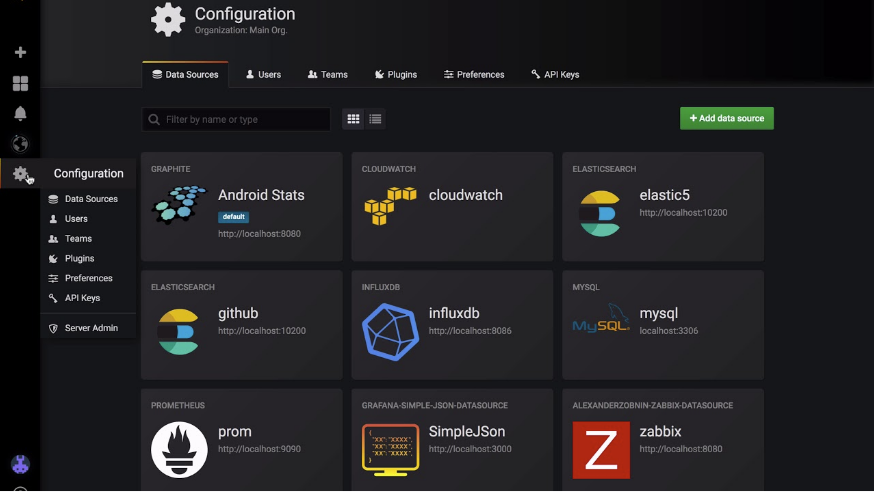
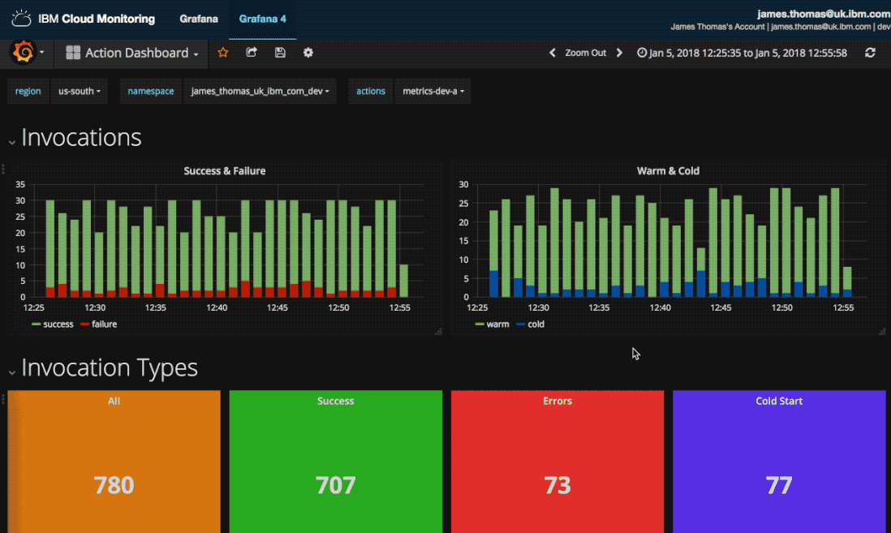
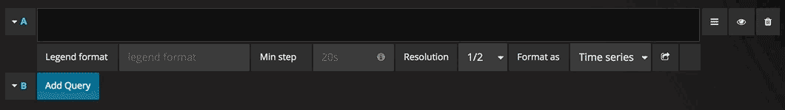
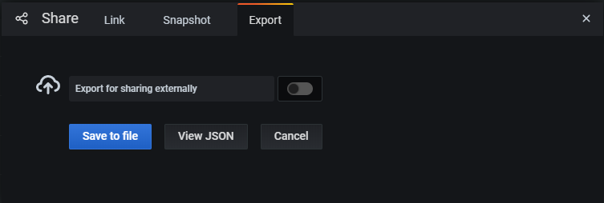
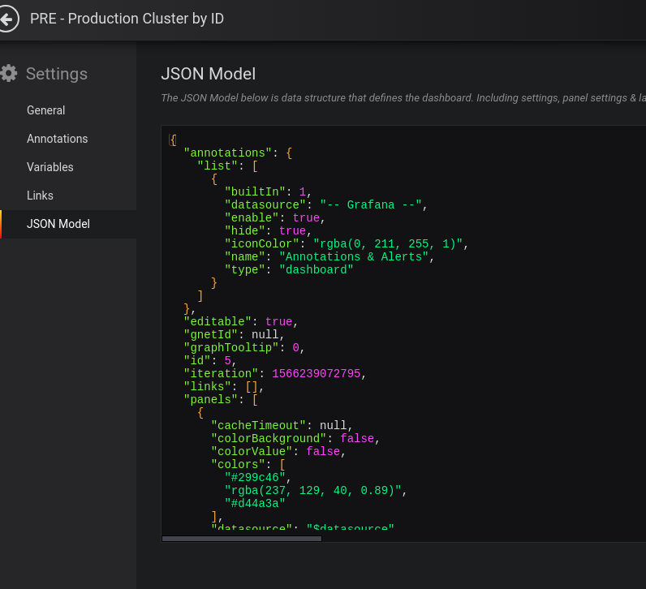

# Grafana Dashboards

[Grafana](https://grafana.com/) is an open source metric analytics & visualization suite. It is most commonly used for visualizing time series data for infrastructure and application analytics but many use it in other domains including industrial sensors, home automation, weather, and process control. Grafana allows users to create dashboards with panels, each representing specific metrics over a set time-frame. Every dashboard is versatile and could be custom-tailored for a specific project or any development and/or business needs.

## Getting Started With Grafana

### Step 1: Installing Grafana

Grafana can be installed on many different operating systems. For a list of the minimum hardware and software requirements, as well as instructions on installing Grafana, refer to [Install Grafana](https://grafana.com/docs/grafana/latest/installation/).

We have [Grafana](https://grafana.com/) deployed in one of the [Operate First](https://www.operate-first.cloud/) instances and it can be accessed [here](https://grafana.operate-first.cloud/). You can follow the instructions for accessing and adding dashboards [here](https://www.operate-first.cloud/hitchhikers-guide/apps/docs/grafana/add_grafana_dashboard.md).

### Step 2: Log In

To log in to Grafana (installed locally) for the first time:

1. Open your web browser and go to http://localhost:3000/. The default HTTP port that Grafana listens to is 3000 unless you have configured a different port.
2. On the login page, enter `admin` for username and password.
3. Click **Log in**. If login is successful, then you will see a prompt to change the password.
4. Click **OK** on the prompt, then change your password.

### Step 3: Create a Dashboard

Before creating a new dashboard, let’s get familiar with some of the components in Grafana.

**Grafana Notions:**

* **Data Source**- Grafana supports many different storage backends for your time series data **(Data Source)**. Each Data Source has a specific Query Editor that is customized for the features and capabilities that the particular Data Source exposes. The following data sources are officially supported: [Graphite](https://grafana.com/docs/features/datasources/graphite/), [InfluxDB](https://grafana.com/docs/features/datasources/influxdb/), [OpenTSDB](https://grafana.com/docs/features/datasources/opentsdb/), [Prometheus](https://grafana.com/docs/features/datasources/prometheus/), [Elasticsearch](https://grafana.com/docs/features/datasources/elasticsearch/), [CloudWatch](https://grafana.com/docs/features/datasources/cloudwatch/).

* **Panel** - A panel is the basic visualization building block presented per the metrics selected. Grafana supports graph, singlestat, table, heatmap, and freetext panels, as well as integration with official and community-built plugins (like world map or clock) and apps that could be visualized, too. Each panel can be customized in terms of style and format; all panels could be dragged, dropped, resized, and rearranged. You can learn more about panels [here](https://grafana.com/docs/grafana/latest/panels/).

* **Dashboard** - A dashboard is a set of individual panels arranged on a grid with a set of variables (like server, application and sensor name). By changing variables, you can switch the data being displayed in a dashboard (for instance, data from two separate servers). All dashboards could be customized and sliced and diced depending on the user's needs. Grafana has a large community of contributors and users, so there is a large ecosystem of ready-made dashboards for different data types and sources. You can learn more about dashboards [here](https://grafana.com/docs/grafana/latest/dashboards/).

* **Query Editor** - The query editor exposes capabilities of your data source and allows you to query the metrics that it contains. Use the Query Editor to build one or more queries (for one or more series) in your time series database. The panel will instantly update allowing you to effectively explore your data in real time and build a perfect query for that particular panel.

Now that you are familiar with the components, you can go ahead and start creating your dashboards.

To create your first dashboard:

1. Configure your data source by going to **Configuration (Gear icon) -> Data Sources -> Add data source**
    1. Select the data source you want to configure
    2. Provide the data source details

        
    3. Click **Save and Test**
    4. If successful, you will see the data source added
2. Click the **+** icon on the left hand side menu
3. On the dashboard, click **Add an empty panel**
4. In the New dashboard/Edit panel view, go to the **Query tab**
5. Configure your query by selecting your data source from the data source selector
6. Click the **Save** icon in the top right corner of your screen to save the dashboard
7. Add a descriptive name, and then click **Save**

Congratulations, you have created your first dashboard and it is displaying results!

### Step 4: Storing and Managing Dashboards

You can store and also maintain your dashboards via GitOps. Any changes require code changes and review via PRs. Dashboards can be stored in Gitlab/Github repositories as yaml k8s config maps that are applied to the cluster and mounted by Grafana. Grafana dashboards can be easily imported and exported as JSON files.

**Exporting Dashboards**

The export feature is accessed in the share window which you open by clicking the share button in the dashboard menu.

Copy the JSON model for the dashboard and insert into the config map YAML and commit to the repository in GitHub where the Grafana manifests are defined and deployed from.

Make a Pull Request for this dashboard in GitHub. You can follow the instructions [here](https://www.operate-first.cloud/hitchhikers-guide/apps/docs/grafana/add_grafana_dashboard.md) for adding dashboards to the [Operate First Grafana](https://grafana.operate-first.cloud/) instance.
