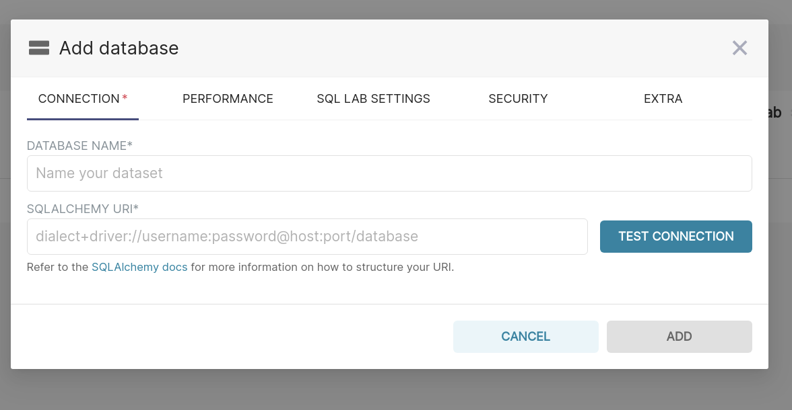
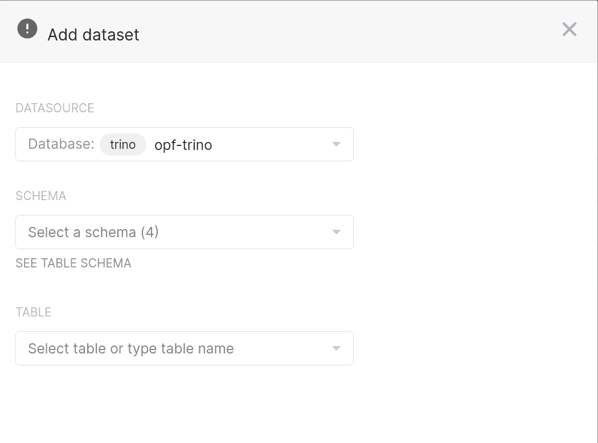

# Superset

[Apache Superset](https://superset.apache.org/) is an open source modern data exploration and visualization platform. Superset can query data from any SQL-speaking data store or data engine. Some of the databases supported are [PostgreSQL](https://www.postgresql.org/), [MySQL](https://www.mysql.com/), [Trino](https://trino.io/) etc. Superset comes with an intuitive interface for visualizing datasets and creating interactive dashboards. It also has an in-built SQL lab to explore and test your queries.

## Getting Started with Superset

**Step 1: Installing Superset**

Superset can be installed on many different operating systems.  For a list of the minimum hardware and software requirements, as well as instructions on installing Superset, refer to [Install Superset](https://superset.apache.org/docs/installation/installing-superset-using-docker-compose).

We have Superset deployed in one of the [Operate First](https://www.operate-first.cloud/) instances and it can be accessed [here](https://superset.operate-first.cloud/).
The Operate First Superset primarily uses a [Trino](https://trino.io/) database, but also onboards other teams to connect their own databases. You can follow the instructions for accessing and creating dashboards [here](https://www.operate-first.cloud/users/support/docs/trino_superset_user_guide.md).

**Step 2: Connecting to Databases**

Superset requires a Python DB-API database driver and a SQLAlchemy dialect to be installed for each datastore you want to connect to.
You can read more [here](https://superset.apache.org/docs/databases/dockeradddrivers) about how to install new database drivers into your Superset configuration.

You’ll need to install the required packages for the database you want to use as your metadata database as well as the packages needed to connect to the databases you want to access through Superset. For example, if you wish to use Trino you will need to install the required package:

```python
pip install sqlalchemy-trino
```
For more information on configuring databases refer [here](https://superset.apache.org/docs/databases/installing-database-drivers).

**Step 3: Adding Database to Superset**

Once you have the database drivers installed and connected, you can login to Superset and add the database from the UI by:

1. Clicking on `Data -> Databases -> + Database`
2. Provide the database configuration



3. Click on `Test Connection` to check if your database configuration is successful

**Step 4: Adding Datasets**

Once you have successfully configured the database, you can now start importing your data. The data stored in your database should be imported into suitable tables and these tables can then be imported as datasets into Superset that are used for creating queries and generating charts.

You can use a suitable database management tool for creating tables, schemas, views etc to import data. We use [CloudBeaver](https://cloudbeaver.io/), a popular web application which provides a rich UI for working and interacting with SQL databases. You can [configure your database in CloudBeaver](https://cloudbeaver.io/docs/Administration/) and start creating tables like so:

```mysql
CREATE TABLE IF NOT EXISTS <database catalog name>.<schema name>.<table name> (
        <column name> <data type>,
        <column name> <data type>,
        ...
)
WITH (
   external_location = '<path_to_data_folder>',
   format = '<CSV,JSON,PARQUET etc>'
)
```

We use S3 buckets to store our datasets and create suitable tables for them in our Trino databases with the help of CloudBeaver.

Once you have the tables created in your database, you can go ahead and import them to Superset by:

1. Clicking on `Data -> Datasets -> + Dataset`
2. Provide the table information



3. Add the dataset

**Step 5: Creating Charts**

To create a chart, click on the **Charts** tab on top and add a new chart by clicking on the **+ Chart** button. Select the dataset (that you added above) and the visualization type. Based on the chart type selected, you will have various fields to edit and write appropriate SQL queries for visualizing the data.

**Step 6: Adding a Dashboard**

You can save your charts and add them to a new or existing dashboard. In order to share your dashboard with others, make sure to click on **Publish** next to the dashboard title name and copy the dashboard URL generated. You can also edit the properties of each dashboard. To do so, click on the **Dashboards** tab to view the list of dashboards. Hover under the **Actions** column next to the dashboard name you are interested in. Click on the **pencil icon**, to edit the fields such as adding owners to the dashboard, creating a readable URL for the dashboard etc.

**Step 7: Exporting Dashboards**

Another useful feature of Superset is the ability to quickly export dashboards. To export a dashboard first go to the **Dashboards** tab of the top bar. Next, hover under the **Actions** column next to the dashboard you would like to export. Finally, click on the arrow icon to export the dashboard and a JSON file download should start. Make sure that you have pop-ups enabled for this page or the download might not run.

Congratulations you have created your first dashboard using Superset!

You can follow the above mentioned steps in more detail on our [Operate First website](https://www.operate-first.cloud/users/support/docs/trino_superset_user_guide.md).
