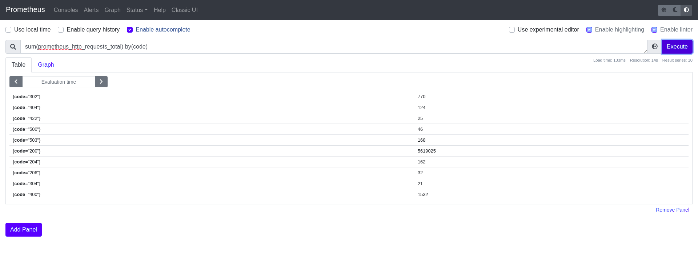

# Prometheus

[Prometheus](https://prometheus.io/) is an open source systems monitoring and alerting toolkit. Prometheus provides time series data identified by metric name and key/value pairs for various services and applications being monitored.

**Data Type**: time series

**Data Granularity**: seconds, minutes, hours, days

**Users**: SRE (Site Reliability Engineering) teams, DevOps teams, Data Scientists

**Example Prometheus Instance**: http://demo.robustperception.io:9090/graph

Shown above is the Prometheus UI which allows you to search and aggregate different time series metrics and view them as a graph.

## Purpose and use of Prometheus

Prometheus has become the industry standard for monitoring, and is implemented by software companies worldwide. It supports multidimensional data collection and data queuing, and is reliable, allowing customers to quickly diagnose problems.

**Operations Perspective** - From an operations standpoint, Prometheus is useful in tracking the performance of various services/applications and enables SRE teams to effectively diagnose, troubleshoot and handle incidents for any degradation of services.

**Data Science Perspective** - From a Data Science standpoint, Prometheus provides a large collection of time series data for exploring and applying ML methods to solve unique problems such as time series forecasting to predict a future system failure or anomaly detection to identify erratic or erroneous system behavior.

* [Example of Time Series Forecasting](https://www.operate-first.cloud/data-science/time-series/notebooks/ts-4-forecasting.ipynb)
* [Interactive Time Series Forecasting Tutorial](https://learn.openshift.com/ai-machine-learning/prometheus-timeseries-forecasting/)

## Anatomy of a Prometheus Metric

A metric in Prometheus consists of:
* **metric name** - The name of the metric Eg: `http_requests_total`

* **labels (key/value pair)** - Labels enable Prometheus's dimensional data model: any given combination of labels for the same metric name identifies a particular dimensional instantiation of that metric.
For example, `http_requests_total{method="POST", handler="/messages", code="200"}` has the labels `method`, `handler` and `code` which have the values `POST`, `/messages` and `202` respectively.

* **timestamp/value** - For each metric, Prometheus records and outputs the timestamp and the value of the metric at that give timestamp.

**Metric Notation**: `<metric name>{<label name>=<label value>, ...}`

## Long Term Storage: Thanos

Prometheus includes a local on-disk time series database (TSDB), but also optionally integrates with remote storage systems. By default, Prometheus stores data to local TSDB which has a retention period of 15 days, any data outside this retention is automatically deleted. In order to store the data for long term, we recommend setting up [Thanos](https://thanos.io/). Thanos is a highly available Prometheus setup with long term storage capabilities and unlimited retention policies. Thanos also helps in downsampling historical data for massive query speedup when querying large time ranges. You can follow [this](https://thanos.io/tip/thanos/getting-started.md/) guide for more details on how to setup Thanos.

## Accessing Prometheus Data

### PromQL

Similar to SQL, Prometheus has a querying language called [PromQL](https://prometheus.io/docs/prometheus/latest/querying/basics/) that can be used to fetch, query and aggregate the time series metrics. The result of a PromQL expression can either be shown as a graph, viewed as tabular data in Prometheus's expression browser, or consumed by external systems via the [HTTP API](https://prometheus.io/docs/prometheus/latest/querying/api/).

PromQL may require some practice before you get the hang of it, but here are some great cheat sheets that can help you get started:
* https://promlabs.com/promql-cheat-sheet/
* https://timber.io/blog/promql-for-humans/

Here is an example of a PromQL query that finds the `sum` of all HTTP requests grouped by the label `code` which indicates the status codes of the HTTP request such as `200(Success), 404(Server not Found), 500(Internal Server Error)` etc:

### Prometheus API Client

Prometheus metrics can also be programmatically accessed via API client libraries. We have `prometheus-api-client`, a Python wrapper for the Prometheus HTTP API along with additional functionality for further metric processing. This API client can be used to fetch, query and perform metric processing within Python supported environments such as Jupyter notebooks and is particularly useful for Data Scientists who are interested in examining these time series type of data.

* [API Client](https://github.com/AICoE/prometheus-api-client-python)

* [Example Jupyter Notebook](https://github.com/AICoE/prometheus-api-client-python/blob/master/examples/MetricsList_example.ipynb) - This example Jupyter notebook explains the API client library and its functions supported

* [Tutorial](https://learn.openshift.com/ai-machine-learning/prometheus-api-client/) - Interactive tutorial on using the Prometheus API client library

## Caveats

* As Prometheus metrics have many labels, they have to be carefully combined with other metrics and this can result in an explosion of metric label pairs, making it complex and compute intensive to query

## Resources

Here are some resources which have useful tips and tricks for interacting with Prometheus metrics:

* [Robust Perception Blogs](https://www.robustperception.io/tag/promql) - This is a great collection of blogs that provide help for PromQL
