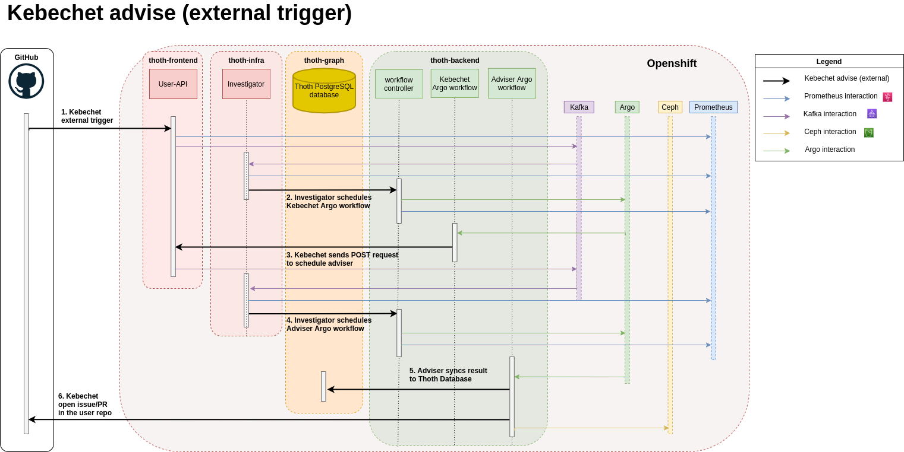
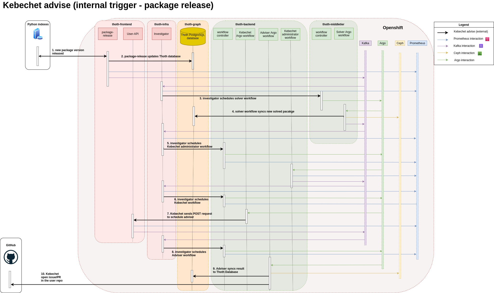

# Kebechet

> I'm Kebechet, goddess of freshness. I will keep your sources and dependencies fresh and up-to-date.

[Kebechet](https://github.com/thoth-station/kebechet) is a SourceOps bot that automates updating dependencies of your project. Currently, it supports managing and
updating Python projects based on [pipenv](https://docs.pipenv.org/) files (`Pipfile` and `Pipfile.lock`) or
`requirements.txt`/`requirements.in` files (see [pip-tools](https://pypi.org/project/pip-tools/) - Kebechet is a
replacement for it).

## Architecture

The components and workflows of Kebechet can be found in the architecture schema below:

## Sequence Diagrams

The two images below show two sequence diagrams of the behaviour of Kebechet in two cases:

- when some user interacts with the GitHub App (external-trigger).

- when internal components triggers learning of new knowledge and share of this knowledge with users (internal trigger)

As you can see, there are different workflows that are triggered to manage your Python dependencies using Thoth's recommendation system. You can request directly for guidance to the service (external trigger) or your repository will be automatically updated with the optimal Python software stack for your project without you having to lift your finger (internal trigger). You can have a detailed description of all the components involved into Kebechet [here](./tooling.md).
