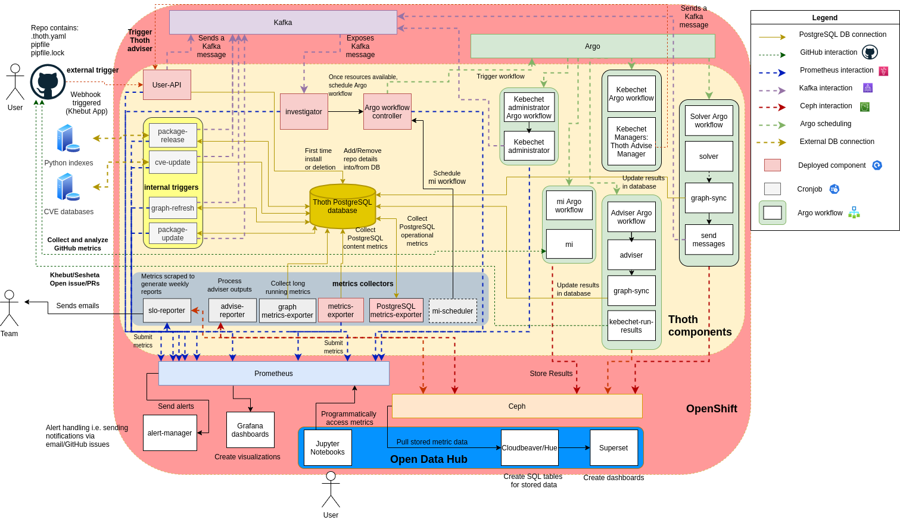

# Kebechet

> I'm Kebechet, goddess of freshness. I will keep your sources and dependencies fresh and up-to-date.

[Kebechet](https://github.com/thoth-station/kebechet) is a SourceOps bot that automates updating dependencies of your project. Currently, it supports managing and
updating Python projects based on [pipenv](https://docs.pipenv.org/) files (`Pipfile` and `Pipfile.lock`) or
`requirements.txt`/`requirements.in` files (see [pip-tools](https://pypi.org/project/pip-tools/) - Kebechet is a
replacement for it).

## Architecture

The components and workflows of Kebechet can be found in the architecture schema below:

